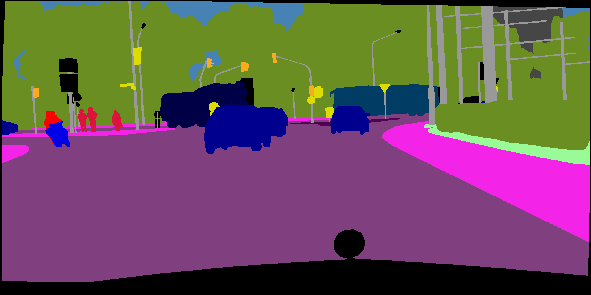

## Introduce

Segmentation is what you need. Support deeplapv3 plus now.

|Model|Backbone|Datasets|TrainSet|EvalSet|eval size|epochs|Mean IoU(paper)|Mean IoU(this repo)|
|:-:|:-:|:-:|:-:|:-:|:-:|:-:|:-:|:-:|
|DeepLabv3_plus|xception65|cityscape|train|val|(1025,2049)|60|78.8|78.5|



## Environments

- OS: Ubuntu16.04
- python 3.7.4
- torch >= 1.1.0
- torchvision
- pyyaml
- Pillow
- numpy
- tqdm
- requests


## Dataset prepare

Goto[Cityscape](https://www.cityscapes-dataset.com)register a account and download datasets.
put cityscape data as follow:
```
datasets/cityscape/
|-- gtFine
|   |-- test
|   |-- train
|   `-- val
|-- leftImg8bit
    |-- test
    |-- train
    `-- val
```

## Pretrained backbone models 

pretrained backbone models will be download automatically in pytorch default directory.

## Code structure
```
├── configs    # yaml config file
├── segmentron # core code
├── tools      # train eval code
└── datasets   # put datasets here 
```

## Train
cd tools
```
export NGPUS=4
export CUDA_VISIBLE_DEVICES=0,1,2,3 
python -m torch.distributed.launch --nproc_per_node=$NGPUS train.py \
          ../configs/cityscapes_deeplabv3_plus.yaml
```

## Eval

```
export NGPUS=4
export CUDA_VISIBLE_DEVICES=0,1,2,3 
python -m torch.distributed.launch --nproc_per_node=$NGPUS eval.py \
          ../configs/eval_cityscapes_deeplabv3_plus.yaml
```

## References
- [PyTorch-Encoding](https://github.com/zhanghang1989/PyTorch-Encoding)
- [maskrcnn-benchmark](https://github.com/facebookresearch/maskrcnn-benchmark)
- [gloun-cv](https://github.com/dmlc/gluon-cv)